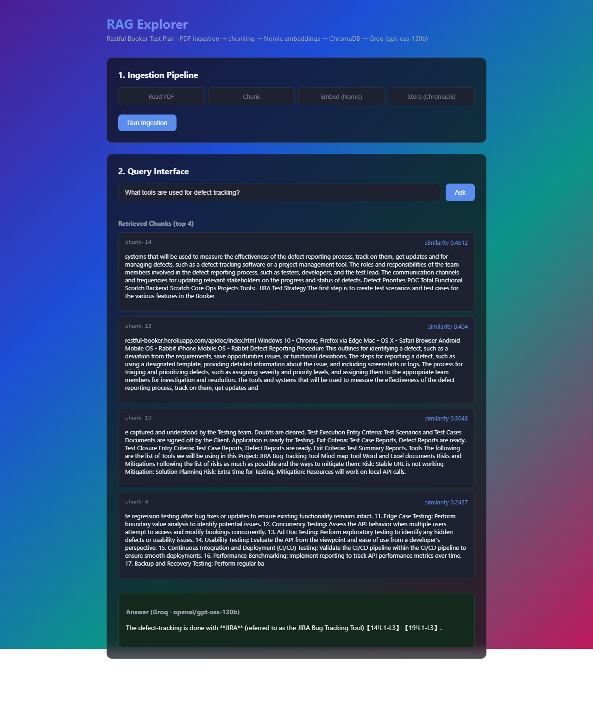

# P10.RAG

RAG (Retrieval-Augmented Generation) experiments — from a bare-bones pipeline to a full explorer UI.

## Projects

### RestfulBooker_RAG

A RAG Explorer app that demonstrates the complete pipeline end-to-end: PDF ingestion, chunking, embedding, vector storage, retrieval, and LLM answer generation — with a React UI that visualizes every stage.

**Source document:** `data/TEST_PLAN.pdf` — a QA Test Plan for the Restful Booker API.

**Pipeline:**
1. Read the PDF (`pypdf`)
2. Split into overlapping chunks (~800 chars, 120 overlap)
3. Embed each chunk with **Nomic Embed** (`nomic-ai/nomic-embed-text-v1.5`, local, no API key)
4. Store embeddings in a local **ChromaDB** instance
5. On query: embed the question, retrieve the top-k matching chunks
6. Send the question + retrieved chunks to **Groq** (`openai/gpt-oss-120b`) to generate the final answer

**Stack:** FastAPI + ChromaDB + sentence-transformers (backend), React + Vite (frontend).

**Screenshot:**



**Run it:**

```bash
# backend
cd RestfulBooker_RAG/backend
python -m venv venv
venv/Scripts/pip install -r requirements.txt
cp .env.example .env   # add your GROQ_API_KEY
venv/Scripts/python -m uvicorn main:app --port 8000

# frontend
cd RestfulBooker_RAG/frontend
npm install
npm run dev
```

Open http://localhost:5173, click **Run Ingestion**, then ask a question.

### Basic_RAG

Prompt spec + source PRD (`data/PRD.pdf`) for a simpler single-document RAG walkthrough.

### Advance_RAG

Reserved for a more advanced RAG setup (multi-doc, re-ranking, etc.) — not yet built.
